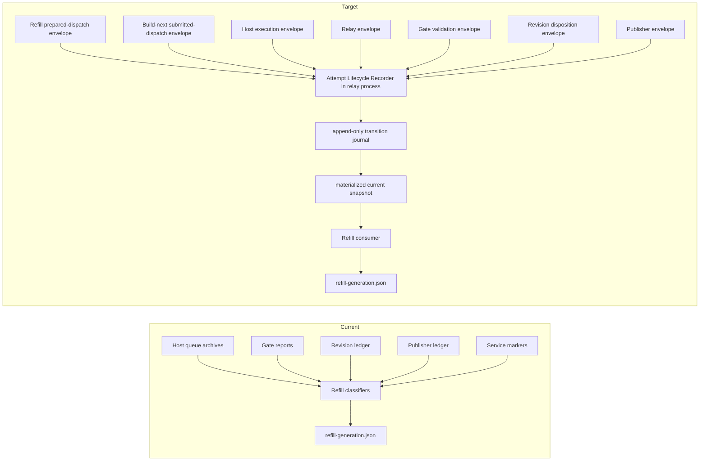

# Canonical Refill Attempt Disposition V1

Status: Draft architecture for Issue #98

Scope: This document defines the target lifecycle contract for capacity-one refill attempts.
It does not authorize implementation, runtime state changes, Issue #50 retry/exclusion, or
B/C dispatch.

## Inputs Reviewed

- Issue #98, "Architecture review: canonical terminal disposition for refill attempts".
- Issue #98 decision comment `#5108427193`.
- Independent architecture review `#4800845999` on draft PR #99.
- Independent architecture re-review `#4800936580` on draft PR #99 exact head
  `8a33a5d80c138a551234f36868741e4f59f33c16`.
- Issue #98 comment `#5108533626`.
- Independent final architecture re-review `#4801024367` on draft PR #99 exact head
  `d45d50e00ed1f0c9a0138394975d4d3b6af18775`.
- Issue #98 comment `#5108644779`.
- Draft PR #92 repair-admission document state.
- Issue #50, especially runtime evidence comment `#5108108854` and the circuit-breaker
  comment that opened #98.
- Issue #89, "Add evidence-preserving supersession for paused unresolved refill generations".
- Issue #82, "Canonicalize dependency-source hashes across Git line endings".
- Issue #95, "Make refill service graceful stop race-free and deterministic".
- `docs/PERSISTENT_WINDOWS_HOST_V1.md`.
- `docs/CANDIDATE_INTEGRATION_GATE_V1.md`.
- `docs/CONTROLLED_DRAFT_PUBLISHER_V1.md`.
- `docs/AUTOBUILDER_OPERATING_MANUAL_V1.md`.
- `src/msos_autobuilder/refill_controller.py`.
- `src/msos_autobuilder/results_relay.py`.
- `src/msos_autobuilder/candidate_gate.py`.
- `src/msos_autobuilder/revision_loop.py`.
- `src/msos_autobuilder/controlled_publisher.py`.
- `src/msos_autobuilder/service_error_lifecycle.py`.
- Managed MSOS source copy of `docs/SOP/CHATGPT_GITHUB_CODEX_CONTROL_PLANE_V1.md`.

Evidence note: `docs/AUTOBUILDER_REPAIR_ADMISSION_AND_CURRENT_DECISION_V1.md` exists on
open draft PR #92. It is not on `main`. Issue #98 contains the active circuit-breaker
decision for Issue #50.

## Current Lifecycle And Evidence Owners

Current refill state is generation-scoped and lives under the host root:

| Durable record | Current writer | Current reader | Current meaning |
|---|---|---|---|
| `state/refill-policy.json` | Refill CLI/service | Refill service | Enabled, desired capacity, pause/resume, dispatch limits |
| `state/refill-generation.json` | Refill CLI/service | Refill service | Active generation, current attempt, exclusions, provider retry state |
| `state/refill-generation-history/*.json` | Refill CLI/service | Refill service/operator | Immutable archived generation bytes |
| `state/refill-generation-supersessions/*.json` | Refill CLI/service | Refill service/operator | Exact supersession receipt for acknowledged ambiguous historical generations |
| `queue/pending/<job-id>/job.yaml` | Host feed importer | Host/refill | Imported but not yet running job |
| `queue/running/<job-id>/job.yaml` | Host | Host/refill | Claimed running job |
| `queue/completed/<job-id>/report.json` | Host | Relay/refill | Worker completed with patches/report |
| `queue/failed/<job-id>/error.json` | Host | Refill/operator | Worker or host failed before a completed result |
| `state/results-relay-seen.json` | Results relay | Relay/operator | Completed host result was relayed to results branch |
| `state/candidate-gate-seen.json` | Candidate gate | Gate/error lifecycle | Gate processed immutable result evidence |
| `state/candidate-gate-results-repo/results/*/<job-id>/gate-report.json` | Candidate gate | Refill/revision/publisher | Candidate validation result |
| `state/revision-loop-seen.json` | Revision loop | Refill/error lifecycle | Failed gate produced a revision job |
| `state/controlled-publisher-seen.json` | Controlled publisher | Refill/error lifecycle | Passed candidate produced verified draft-publication disposition |
| `state/*-error.json` | Gate/revision/publisher | Refill/error lifecycle | Service-local error marker |
| `state/*-service-success.json` | Gate/revision/publisher | Error lifecycle/refill | Later service success that may supersede service-local errors |

Current refill reconstructs terminality by reading host archives, gate reports, revision
ledger entries, publisher ledger entries, service error markers, and feed/queue state.
`_classify_failed_attempt` only recognizes structured provider failures and a small
provider text-token fallback. Ordinary worker failures, including the Issue #50
`.pytest_cache` `PermissionError`, become `category: unknown`, and reconcile converts that
into `BLOCKED` with `reason: ambiguous_attempt`.

## Required V1 Architecture Decision

The Attempt Lifecycle Recorder is accepted as the sole logical canonical disposition
writer. It owns canonical attempt, work-item, generation, and refill-action reduction.

For v1, the recorder is hosted inside the existing persistent results relay service and
process. This preserves the existing six-service managed topology:

1. persistent host;
2. result relay, now also hosting the logical Attempt Lifecycle Recorder;
3. candidate gate;
4. revision loop;
5. controlled draft publisher;
6. capacity-one refill service.

This is a logical ownership decision, not a seventh managed service. A future standalone
recorder service would require a separate accepted architecture decision, supervisor and
witness changes, and proof that splitting the process is simpler than the relay-hosted v1.

The boundaries are:

| Boundary | Decision |
|---|---|
| Logical component ownership | Attempt Lifecycle Recorder is the only canonical disposition writer and reducer. |
| Process/service deployment | Recorder runs inside the existing persistent relay process for v1. |
| Lifecycle lock | Recorder alone writes through `state/attempt-lifecycle.lock`; refill, host, gate, revision, and publisher do not hold it. |
| Durable canonical paths | Recorder writes only under `state/attempt-lifecycle/`; refill continues to own `state/refill-generation*.json`. |
| Evidence ownership | Refill, host, relay, gate, revision, publisher, and service-error lifecycle own their source evidence envelopes. |
| Freshness protocol | Durable watermark only. Refill never invokes recorder lifecycle-writing or reducer code directly. |

Current-versus-target data flow:

## Versioned Lifecycle Evidence Envelopes

Every post-recorder attempt must be represented by small versioned structured lifecycle
evidence envelopes. The recorder validates and reduces these envelopes. It must not parse
arbitrary service text, infer terminality from raw ledgers, or inherit refill's current
multi-artifact interpretation role for post-recorder attempts.

Raw service-ledger adapters and text interpretation are migration-only. They are allowed
only for historical evidence created before the recorder release and must be fenced by
generation metadata and source hashes.

Each envelope includes at least:

| Field | Meaning |
|---|---|
| `schema_version` | Evidence schema version, with reducer compatibility declared explicitly. |
| `evidence_kind` | One of the producer kinds below. |
| `evidence_id` | Stable immutable identity for this evidence event. |
| `producer_sequence` | Monotonic integer scoped to canonical attempt identity plus `evidence_kind`. |
| `attempt_identity` | Canonical repository, pipeline, work item, generation, and job identity. |
| `source_path` or `source_ref` | Durable local path, Git ref/path, or feed identity that produced the envelope. |
| `source_sha256` | SHA-256 of the immutable source bytes. |
| `producer` | Service/component name and release identity. |
| `recorded_at` or `observed_at` | Producer timestamp. |
| `final` | Boolean declaring whether this producer stream is closed for this identity/kind. |
| `payload` | Structured stable codes for the relevant outcome or disposition. |

Required post-recorder envelope kinds:

| Envelope kind | Producer | Required stable payload codes |
|---|---|---|
| `dispatch.prepared` | Refill controller | selected work item, generation ID, dispatch intent hash, capacity slot identity |
| `dispatch.submitted` | Build-next submission component | jobs feed commit, feed path, submitted job hash |
| `host.execution` | Persistent host | pending/running/completed/failed execution outcome, host archive path, error class code when failed |
| `relay.result` | Results relay | relayed commit, canonical report hash, complete patch reconstruction integrity |
| `gate.validation` | Candidate gate | passed/failed/blocked/missing/conflict, validation contract identity, gate report hash |
| `revision.disposition` | Revision loop | queued/exhausted/blocked/not required/missing/conflict, descendant job identity when queued |
| `publication_review.disposition` | Controlled publisher | awaiting review/drafted/rejected/terminal no-publication/blocked/missing/conflict |

Human or founder review input is not a lifecycle disposition writer in v1. The controlled
publisher consumes preserved review input and emits the single
`publication_review.disposition` envelope. If human review must be separately durable
producer evidence, it uses a separate input-only envelope kind:

| Envelope kind | Only writer | Immutable envelope path |
|---|---|---|
| `human_review.input` | Human-review intake component | `state/review-evidence/human-input/<generation-id>/<job-id>/<identity-digest>.<evidence-id>.json` |

Producer-owned envelope storage is exact and outside the recorder-only canonical namespace:

| Envelope kind | Only writer | Immutable envelope path |
|---|---|---|
| `dispatch.prepared` | Refill controller | `state/refill-evidence/dispatch/prepared/<generation-id>/<job-id>/<identity-digest>.<evidence-id>.json` |
| `dispatch.submitted` | Build-next submission component | `state/refill-evidence/dispatch/submitted/<generation-id>/<job-id>/<identity-digest>.<evidence-id>.json` |
| `host.execution` | Persistent host | `state/host-evidence/execution/<generation-id>/<job-id>/<identity-digest>.<evidence-id>.json` |
| `relay.result` | Results relay | `state/relay-evidence/result/<generation-id>/<job-id>/<identity-digest>.<evidence-id>.json` |
| `gate.validation` | Candidate gate | `state/gate-evidence/validation/<generation-id>/<job-id>/<identity-digest>.<evidence-id>.json` |
| `revision.disposition` | Revision loop | `state/revision-evidence/disposition/<generation-id>/<job-id>/<identity-digest>.<evidence-id>.json` |
| `publication_review.disposition` | Controlled publisher | `state/publisher-evidence/publication-review/<generation-id>/<job-id>/<identity-digest>.<evidence-id>.json` |

Envelope files are immutable. A producer may write a later envelope with a new `evidence_id`,
but it must not replace or edit an existing envelope. `state/attempt-lifecycle/` remains
recorder-only and contains no producer-owned input files.

## Canonical Producer Heads

Every canonical attempt identity plus evidence kind has one producer-owned monotonic stream.
The stream is ordered only by `producer_sequence`; timestamps, evidence IDs, directory order,
or Git commit order are never freshness authority.

Each producer writes immutable envelopes and one atomic producer-owned head record:

| Head field | Meaning |
|---|---|
| `head_schema_version` | Literal `producer_head.v1`. |
| `attempt_identity` | The exact canonical attempt identity embedded in the envelope. |
| `identity_digest` | SHA-256 identity digest used in paths. |
| `evidence_kind` | One envelope kind from the producer-owned table. |
| `producer` | The sole logical writer for this kind. |
| `producer_sequence` | Latest contiguous sequence committed for this identity/kind. |
| `evidence_id` | Evidence ID at that sequence. |
| `envelope_path` | Immutable envelope path for that sequence. |
| `envelope_sha256` | SHA-256 of the immutable envelope bytes. |
| `final` | `true` when the producer stream is legitimately closed; otherwise `false`. |
| `closed_status` | `open`, `final`, or `not_applicable`. |

Head paths are producer-owned and atomic:

| Envelope kind | Head path |
|---|---|
| `dispatch.prepared` | `state/refill-evidence/heads/dispatch/prepared/<identity-digest>.json` |
| `dispatch.submitted` | `state/refill-evidence/heads/dispatch/submitted/<identity-digest>.json` |
| `host.execution` | `state/host-evidence/heads/execution/<identity-digest>.json` |
| `relay.result` | `state/relay-evidence/heads/result/<identity-digest>.json` |
| `gate.validation` | `state/gate-evidence/heads/validation/<identity-digest>.json` |
| `revision.disposition` | `state/revision-evidence/heads/disposition/<identity-digest>.json` |
| `publication_review.disposition` | `state/publisher-evidence/heads/publication-review/<identity-digest>.json` |

Producer head update semantics are deterministic:

1. The producer writes the immutable envelope for `producer_sequence=N`, computes its
   `envelope_sha256`, then atomically replaces its head record with the same `N`.
2. Replaying the identical head for the identical sequence, evidence ID, envelope path,
   envelope SHA-256, `final`, and `closed_status` is idempotent.
3. A head with `producer_sequence` lower than the current head is sequence regression and is
   rejected as `evidence_conflict`.
4. A head with the same `producer_sequence` but any different evidence ID, envelope path,
   envelope SHA-256, `final`, or `closed_status` is conflicting same-sequence evidence and is
   rejected as `evidence_conflict`.
5. A head with `producer_sequence` greater than current sequence plus one is a sequence gap.
   The recorder must not skip to it. The producer must supply the missing contiguous
   sequence or an explicit `not_applicable`/`final` disposition where allowed; until then,
   the canonical snapshot records `evidence_integrity=missing` and refill blocks fail-closed.
6. A head with `closed_status=final` or `closed_status=not_applicable` closes that
   identity/kind stream and must also set `final=true`.
7. Later identical replay of a closed head is idempotent. Later non-idempotent evidence for a
   closed stream is `evidence_conflict`.

`latest_evidence_set` is derived only from producer head records. It is the sorted list of
applicable producer heads for the canonical attempt identity and lifecycle phase, including
closed `not_applicable` heads when a kind is required to declare non-applicability. It is
never derived by scanning envelope directories or comparing timestamps.

Required/applicable envelope kinds by lifecycle phase:

| Lifecycle phase | Required or applicable producer heads |
|---|---|
| `dispatch_prepared` | `dispatch.prepared` required and open or final; later kinds not yet applicable. |
| `dispatch_submitted` through host pending/running | `dispatch.prepared` and `dispatch.submitted` required; `host.execution` required once host imports the job. |
| `execution_archived` | `host.execution` required and `final=true`; `relay.result` applicable for completed execution, or `relay.result` must close `not_applicable` for terminal host failure with no result. |
| `result_relayed` | `relay.result` required and `final=true`; `gate.validation` required until validation is recorded. |
| `validation_recorded` with passed validation | `gate.validation` required and `final=true`; `revision.disposition` must close `not_applicable`; `publication_review.disposition` required until publisher disposition is final or blocked. |
| `validation_recorded` with failed validation | `gate.validation` required and `final=true`; `revision.disposition` required until queued, exhausted, blocked, missing, or conflict; `publication_review.disposition` must close `not_applicable` unless a descendant passed validation. |
| `revision_recorded` | `revision.disposition` required and `final=true` for exhausted, blocked, missing, conflict, or queued descendant handoff; publisher remains `not_applicable` for the failed parent attempt. |
| `publication_review_recorded` | `publication_review.disposition` required; final item-terminal dispositions, rejected terminal reasons, terminal no-publication, and durable blocks close with `final=true`. Awaiting review remains `final=false`. |
| `blocked` | Every producer kind that is applicable to the reached phase must have either a current head, an explicit `not_applicable` final head, or a canonical `evidence_missing`/`evidence_conflict` disposition. |

## Canonical Record Model

The canonical model is one orthogonal current record per attempt plus one current record per
canonical work item. It is not one overloaded lifecycle-state enum.

Canonical attempt identity is one exact versioned JSON tuple. No other representation is a
valid path key or equality key for v1.

| Field | Meaning |
|---|---|
| `schema_version` | Literal `attempt_identity.v1`. |
| `repository_identity` | Literal canonical repository identity string `<owner>/<repo>` for the GitHub repository under control, lower-cased with no trailing `.git`. |
| `pipeline_id` | Autobuilder pipeline or managed release pipeline identity. |
| `work_item_id` | Stable work item identifier. |
| `work_item_digest_contract` | Literal `work_item_source_sha256_v1`. |
| `work_item_digest` | SHA-256 of the exact UTF-8 work-item source bytes after normalizing CRLF and CR line endings to LF and preserving all other bytes. |
| `generation_id` | Refill generation that created this attempt. |
| `job_id` | Host job ID for this attempt. |
| `attempt_ordinal` | Existing monotonic attempt ordinal already carried by refill for this work item in this generation. |
| `retry_ordinal` | Existing retry ordinal already carried by refill for this work item in this generation. |

Canonical serialization is UTF-8 JSON with sorted object keys, no insignificant whitespace,
lowercase booleans/null, decimal integer ordinals without leading zeroes, and string values
emitted exactly as stored after the normalization rules above. The `identity_digest` used in
paths is `sha256(canonical_json_bytes)`. The tuple itself is embedded in every envelope,
transition, and snapshot. Alternatives such as repository digest, configured repository ID,
canonical request body digest, bare `work-item-id`, or any parallel attempt counter are not
v1 identity contracts.

Canonical repository/pipeline/work-item identity is required for both attempt and
work-item records. Bare `work-item-id` is insufficient.

The current attempt snapshot includes these fields:

| Field | Values |
|---|---|
| `lifecycle_phase` | `dispatch_prepared`, `dispatch_submitted`, `host_awaiting_import`, `host_pending`, `host_running`, `execution_archived`, `result_relayed`, `validation_recorded`, `revision_recorded`, `publication_review_recorded`, `blocked` |
| `execution_outcome` | `not_started`, `running`, `completed`, `failed`, `interrupted`, `missing`, `conflict` |
| `validation_outcome` | `not_started`, `passed`, `failed`, `blocked`, `missing`, `conflict` |
| `revision_disposition` | `not_required`, `queued`, `exhausted`, `blocked`, `missing`, `conflict` |
| `publication_review_disposition` | `not_required`, `awaiting_review`, `drafted`, `rejected`, `terminal_no_publication`, `blocked`, `missing`, `conflict` |
| `retry_eligibility` | `none`, `same_item_once_after`, `same_item_denied`, `operator_required` |
| `evidence_integrity` | `complete`, `pending`, `missing`, `conflict`, `stale`, `migration_only` |
| `attempt_terminal` | `true`, `false` |
| `item_terminal` | `true`, `false` |
| `refill_action` | `occupy_capacity`, `retry_same_item`, `exclude_item_and_select_next`, `block_fail_closed` |

Historical supersession is not a lifecycle phase. It is generation and migration metadata
attached to records that preserve pre-recorder ambiguity.

## Immutable Transition Journal And Snapshot

Canonical lifecycle storage has two layers:

| Record | Writer | Semantics |
|---|---|---|
| `state/attempt-lifecycle/transitions/<identity-digest>/<sequence>.json` | Attempt Lifecycle Recorder | Immutable append-only transition journal. |
| `state/attempt-lifecycle/current/attempts/<identity-digest>.json` | Attempt Lifecycle Recorder | Materialized current attempt snapshot derived from the journal. |
| `state/attempt-lifecycle/current/work-items/<identity-digest>.json` | Attempt Lifecycle Recorder | Materialized current work-item snapshot derived from attempt snapshots. |
| `state/attempt-lifecycle/current/generations/<generation-id>.json` | Attempt Lifecycle Recorder | Generation metadata, migration status, and reduced-through watermarks. |
| `state/attempt-lifecycle/recovery-ledger.json` | Attempt Lifecycle Recorder | Recorder recovery and replay status. |

Each transition includes:

| Field | Meaning |
|---|---|
| `sequence` | Monotonic sequence number within the attempt identity journal. |
| `previous_transition_sha256` | SHA-256 of the previous transition bytes, or `null` for sequence 1. |
| `transition_sha256` | SHA-256 of the canonical transition bytes, excluding this field. |
| `source_evidence` | List of source evidence identities, source refs/paths, and SHA-256 values reduced into this transition. |
| `recorded_at` | Recorder timestamp. |
| `reducer_version` | Deterministic reducer implementation version. |
| `schema_version` | Canonical transition/schema version. |
| `from_snapshot_sha256` | SHA-256 of the previous materialized snapshot, or `null` for first transition. |
| `to_snapshot_sha256` | SHA-256 of the resulting materialized snapshot. |

The materialized snapshots are replaceable derived state. The transition journal is the
audit source of truth. Replay from journal plus immutable source evidence must deterministically
produce the same current snapshots and `reduced_through` watermarks.

## Refill Freshness Handshake

Refill may not retry, exclude an item, or select the next item from stale canonical evidence.
The only v1 freshness and sole-writer protocol is durable watermark verification plus one
short cross-process evidence-head critical section:

1. Producers write immutable evidence envelopes under their producer-owned paths.
2. Producers atomically update their producer head while holding
   `state/evidence-heads.lock`.
3. The relay-hosted recorder is the only process that appends canonical lifecycle transitions
   and replaces canonical snapshots.
4. Refill never invokes recorder lifecycle-writing or reducer code directly.
5. Stale canonical evidence blocks the current reconcile cycle until the recorder catches up.

`reduced_through` is exact, not time-based. It binds each producer's latest known evidence
identity and SHA-256 for the attempt or generation. A heartbeat alone is insufficient.

The recorder writes this head contract into each attempt, work-item, and generation snapshot:

| Field | Meaning |
|---|---|
| `snapshot_sha256` | SHA-256 of the canonical snapshot bytes, excluding this field. |
| `latest_evidence_set_contract` | Literal `latest_evidence_set_sha256.v1`. |
| `latest_evidence_set` | Sorted list of `{producer, evidence_kind, producer_sequence, evidence_id, envelope_path, envelope_sha256, final, closed_status}` from producer head records for every applicable producer/kind relevant to the identity. |
| `latest_evidence_set_sha256` | SHA-256 of the canonical JSON serialization of `latest_evidence_set`. |
| `reduced_through` | Per producer/kind latest evidence identity and envelope SHA-256 reduced into this snapshot. It must equal the `latest_evidence_set` for the covered scope. |

Before retry, exclusion, or next-item submission, refill must:

1. prepare a candidate retry, exclusion, or next-dispatch action identity without remote side
   effects;
2. acquire `state/evidence-heads.lock`;
3. read producer-owned head records for the active identity and derive the expected
   `latest_evidence_set_sha256`;
4. read the canonical snapshot and verify that `reduced_through` covers that exact evidence
   set and that every stream needed for an item-terminal action has `final=true`;
5. verify that any existing bound `prepared_dispatch` carries the same `snapshot_sha256`,
   `latest_evidence_set_sha256`, action identity, and dispatch/exclusion/retry intent; if no
   prepared dispatch exists for this action, write one with those bindings;
6. durably commit the local action identity for exactly one retry, exclusion, or next
   dispatch while still holding the lock;
7. release `state/evidence-heads.lock` before any remote Git, feed, or network operation;
8. perform remote submission only through the already-bound durable action identity and the
   existing prepared-dispatch crash-recovery path.

If the canonical snapshot, producer heads, final/closed stream status, evidence-set digest,
or bound `prepared_dispatch` do not match inside the lock, refill aborts the action and waits
for another reconcile. The lock is not held while pushing feed commits, fetching Git refs,
calling GitHub, running jobs, or performing any remote operation.

This is the atomic freshness-to-action commitment boundary. Producers use the same lock only
for atomic head replacement. Refill uses it only for the final head read, canonical snapshot
and digest verification, bound `prepared_dispatch` verification, and durable action-identity
commit. It is not a lifecycle writer lock and does not allow refill to append recorder
transitions or replace canonical snapshots.

Stale, absent, missing, or conflicting canonical evidence blocks fail-closed. For
post-recorder attempts, refill may never fall back to direct host, gate, revision, publisher,
relay, service-ledger, or text interpretation. Compatibility fallback is migration-only and
is forbidden once an attempt has post-recorder dispatch evidence.

## Item Disposition To Refill Action

The work-item snapshot contains a deterministic `item_disposition` and total mapping to
`refill_action`:

| `item_disposition` | Required canonical facts | `refill_action` |
|---|---|---|
| `active_dispatch_prepared` | Dispatch prepared or submitted; attempt not terminal | `occupy_capacity` |
| `active_host_running` | Host pending/running/importing; attempt not terminal | `occupy_capacity` |
| `active_relay_or_gate_pending` | Execution completed; relay/gate not yet terminal; evidence integrity pending | `occupy_capacity` |
| `active_revision_pending` | Validation failed; revision disposition not terminal; evidence integrity pending | `occupy_capacity` |
| `active_publication_review_pending` | Validation passed; publication/review disposition awaiting review or pending | `occupy_capacity` |
| `retry_same_item_authorized` | Attempt terminal, item non-terminal, retry eligibility `same_item_once_after`, bounded retry count available, freshness proven | `retry_same_item` |
| `operator_required_execution_failed` | Execution failed, attempt terminal, item non-terminal, retry eligibility `operator_required` | `block_fail_closed` |
| `operator_required_validation_blocked` | Validation blocked/conflicting without queued revision | `block_fail_closed` |
| `operator_required_revision_blocked` | Revision disposition blocked/missing/conflict | `block_fail_closed` |
| `operator_required_publication_blocked` | Publication/review blocked/missing/conflict or rejected without item-terminal reason | `block_fail_closed` |
| `evidence_missing` | Required canonical evidence absent after reducer/watermark proof | `block_fail_closed` |
| `evidence_conflict` | Contradictory or mutated evidence hashes | `block_fail_closed` |
| `evidence_stale` | Durable `reduced_through` does not cover latest known evidence | `block_fail_closed` |
| `item_terminal_success_drafted` | Publication/review disposition drafted and verified | `exclude_item_and_select_next` |
| `item_terminal_no_publication` | Publication/review disposition terminal no-publication with known v1 terminal reason code | `exclude_item_and_select_next` |
| `item_terminal_rejected` | Publication/review disposition rejected with known v1 terminal reason code | `exclude_item_and_select_next` |
| `item_terminal_revision_exhausted` | Validation failed and revision exhausted with known v1 terminal reason code | `exclude_item_and_select_next` |
| `migration_historical_preserved` | Pre-recorder generation preserved byte-for-byte; migration metadata only | `block_fail_closed` |

Any new `item_disposition` value must extend this table in the same PR that introduces it.
There is no free-form terminal prose.

## Terminal Reason Codes V1

Terminal reason codes are versioned structured producer payload values. Every known reason
code maps to exactly one canonical outcome, item disposition, item terminality, and refill
action. Unknown reason codes, missing reason-code table versions, or codes outside the
producer's declared table block fail-closed. Free-form messages remain explanatory evidence
only and cannot determine terminality.

| `reason_code` | Canonical outcome | `item_disposition` | `item_terminal` | `refill_action` |
|---|---|---|---|---|
| `publication_review.drafted.v1` | `publication_review_disposition=drafted` | `item_terminal_success_drafted` | `true` | `exclude_item_and_select_next` |
| `publication_review.no_publication.not_required.v1` | `publication_review_disposition=terminal_no_publication` | `item_terminal_no_publication` | `true` | `exclude_item_and_select_next` |
| `publication_review.no_publication.out_of_scope.v1` | `publication_review_disposition=terminal_no_publication` | `item_terminal_no_publication` | `true` | `exclude_item_and_select_next` |
| `publication_review.rejected.duplicate_or_obsolete.v1` | `publication_review_disposition=rejected` | `item_terminal_rejected` | `true` | `exclude_item_and_select_next` |
| `publication_review.rejected.founder_declined.v1` | `publication_review_disposition=rejected` | `item_terminal_rejected` | `true` | `exclude_item_and_select_next` |
| `revision.exhausted.contract_limit.v1` | `validation_outcome=failed`, `revision_disposition=exhausted` | `item_terminal_revision_exhausted` | `true` | `exclude_item_and_select_next` |
| `revision.exhausted.no_valid_repair.v1` | `validation_outcome=failed`, `revision_disposition=exhausted` | `item_terminal_revision_exhausted` | `true` | `exclude_item_and_select_next` |

Semantics:

1. `attempt_terminal=true` means the specific job attempt has stopped changing and should
   not be rerun by accident.
2. `item_terminal=true` means refill may exclude the work item and select the next eligible item.
3. `attempt_terminal=true` does not imply `item_terminal=true`. Failed execution, failed
   gate, and publisher rejection can still require retry, revision, founder review, or a
   fail-closed block.
4. Ordinary host execution failures, including filesystem `PermissionError`, are deterministic:
   `execution_outcome=failed`, `attempt_terminal=true`, `retry_eligibility=operator_required`,
   `item_terminal=false`, and `item_disposition=operator_required_execution_failed` unless a
   configured structured rule marks the class as safe for an automatic same-item retry.
5. Provider/systemic failures use structured provider evidence only. Text-token fallback in
   refill is a migration-only compatibility behavior and should be deleted after migration.
6. Automatic retry is same-item only, bounded, explicitly counted, freshness-proven, and never
   item-terminal.
7. Failed validation is not item-terminal until revision disposition is canonical.
8. Passed validation is not item-terminal until publication/review disposition is canonical.
9. Evidence missing, conflict, and stale states are not retry signals. They block fail-closed.

## Crash, Restart, And Delayed Evidence

The lifecycle recorder must be idempotent and restart-safe:

1. It reads current durable producer head records and immutable evidence envelopes, then
   writes canonical transitions through `state/attempt-lifecycle.lock`.
2. It appends journal transitions atomically before replacing materialized snapshots.
3. A crash before the journal append is retried by rereading source evidence.
4. A crash after the journal append but before snapshot replacement is repaired by replaying
   the journal.
5. A crash after snapshot replacement is detected by matching transition and snapshot hashes
   and is not duplicated.
6. Delayed evidence may advance a non-terminal snapshot only when all prior evidence hashes
   still match. For example, a gate envelope appearing after completed relay evidence advances
   validation outcome to `failed` or `passed`.
7. Delayed evidence may supersede `evidence_missing` only if the missing state was recorded as
   provisional, the recovery window is still open, and the previous transition hashes replay.
   `evidence_conflict` is never automatically superseded.
8. Service restarts do not clear canonical lifecycle records. They may only add new source
   evidence envelopes and producer heads that the recorder consumes.
9. Refill restart consumes the latest canonical work-item snapshot after the freshness
   handshake. It must not reclassify host, gate, revision, relay, or publisher evidence
   independently for post-recorder attempts.
10. Existing prepared-dispatch crash recovery performs any pending remote submission using
    the already-bound durable action identity. It must not create a new action identity from a
    fresh read after the crash.

## Historical Migration Boundary

Migration is one explicit boundary, not a growing list of incident branches:

1. Existing Issue #89 evidence and the current Issue #50 A evidence remain byte-for-byte
   unchanged. No migration rewrites, moves, retries, excludes, or regenerates them.
2. Migration creates canonical preservation records and one clean-generation authorization
   under a one-time transaction ID:
   `migration.issue89-issue50A.<utc-timestamp>.<migration-input-sha256>`.
3. The migration transaction input binds the active release identity, active release
   SHA-256, old active generation ID, old active generation SHA-256, every Issue #89 and
   current A source path/ref, every source byte length, every source SHA-256, job ID,
   canonical repository/pipeline/work-item identity, and the current refill classification
   bytes it preserves.
4. The migration transaction output lists every journal transition, snapshot digest,
   migration receipt digest, and clean-generation authorization digest it creates. The
   transaction is valid only if the active release, old generation ID, old generation
   SHA-256, and every input SHA-256 still match at commit time.
5. Current A is migrated with known structured facts, not merely historical supersession:
   `execution_outcome=failed`, `attempt_terminal=true`, `item_terminal=false`,
   `retry_eligibility=operator_required`, `evidence_integrity=migration_only`, and
   `item_disposition=operator_required_execution_failed`.
6. Issue #89 unresolved historical generation records are migrated with
   `evidence_integrity=migration_only`, `item_disposition=migration_historical_preserved`,
   and generation metadata that records supersession. Historical supersession is metadata,
   not `lifecycle_phase`.
7. Existing Issue #89 supersession machinery is reused only as the byte-preserving
   generation acknowledgement source and receipt format. It is not reused as a normal
   lifecycle reducer, attempt phase, retry authorization, or item-terminal proof.
8. Historical migration records cannot authorize B because their `refill_action` is
   `block_fail_closed`, their `evidence_integrity` is `migration_only`, their generation
   metadata marks them `pre_recorder=true`, and the freshness handshake rejects them as a
   basis for post-recorder next-item selection.
9. The migration transaction does not itself create the clean generation and performs no
   dispatch. It atomically writes a durable authorization consumed by the next passive
   reconcile: `state/refill-generation-authorizations/clean-post-recorder/<transaction-id>.json`.
10. The clean-generation authorization preserves existing founder policy intent exactly:
    `enabled=true`, desired capacity one. It is not a second founder command, does not create
    new product authority, and does not require another `keep 1 running` command.
11. The authorization permits exactly one clean post-recorder generation for the same bound
    active release and old generation identity/hash. It is consumed idempotently by passive
    reconcile; replay after crash either observes the already-created clean generation receipt
    or creates the same generation once.
12. The authorized clean generation inherits no historical attempts, exclusions, retries,
    terminality, or watermarks. It does not exclude A because current A's historical attempt
    failed. It starts with empty post-recorder lifecycle state and can create only fresh
    `dispatch.prepared` and `dispatch.submitted` envelopes during the next passive reconcile.
13. Current code will need a bounded clean-generation creation transition because it currently
    blocks when no founder-created generation exists. That implementation work is not
    authorized by this document revision.
14. New attempts created after the lifecycle-recorder release must have canonical lifecycle
    records from dispatch onward. Absence is `evidence_missing`, not compatibility fallback.
15. Migration closes after the first accepted managed release and installed proof that a fresh
    A attempt is lifecycle-recorded from dispatch through terminal or blocked disposition.

## Duplicate Interpretation And Deletion Plan

After migration and a successful fresh lifecycle witness, delete or demote these duplicate
interpretation paths:

| Current path | Target action |
|---|---|
| `refill_controller._classify_attempt` reading host/gate/revision/publisher evidence | Replace with canonical attempt/work-item disposition read plus freshness handshake |
| `refill_controller._classify_failed_attempt` text-token provider fallback | Delete after historical migration |
| Refill direct reads of `candidate-gate-results-repo` for terminality | Delete; lifecycle recorder owns interpretation |
| Refill direct reads of `revision-loop-seen.json` for terminality | Delete; lifecycle recorder owns interpretation |
| Refill direct reads of `controlled-publisher-seen.json` for terminality | Delete for terminality; preserve only as migration-only raw input until producer envelopes exist |
| Refill `revision_disposition_missing` and `revision_descendant_disposition_missing` categories | Replace with canonical `revision_disposition=missing` and `item_disposition=operator_required_revision_blocked` |
| Refill `ambiguous_attempt` caused by ordinary failed host archive | Replace with canonical `operator_required_execution_failed` |
| Incident-specific supersession as normal lifecycle tool | Retain only as historical migration/operator escape hatch |
| Service error marker evaluation used by refill as terminal proof | Lifecycle recorder may consume migration-only markers; refill should not |

No source evidence is deleted. Only duplicate interpretation code paths are removed after
the canonical writer has proven coverage.

## Prior-Incident Regression Fixture Map

| Incident fixture | Source issue/evidence | Expected canonical result |
|---|---|---|
| Provider retry/backpressure | Existing structured provider failure tests and refill provider retry behavior | `retry_same_item_authorized` only after trustworthy retry time and only once |
| Failed candidate gate requiring revision | Issue #82 first A dependency-hash gate failure | `validation_outcome=failed`, then `revision_disposition=queued` or `exhausted`; not item-terminal until revision disposition exists |
| Missing publisher/revision disposition | Issue #89 preserved generation | Migration metadata with `item_disposition=migration_historical_preserved`; fresh equivalent becomes `evidence_missing` and blocks |
| Interrupted generation recovery | Existing prepared dispatch/recovery and Issue #95 restart-stop boundary | Restart replays canonical transition or blocks on conflict without duplicate dispatch |
| Ordinary host execution failure | Issue #50 comment `#5108108854`, `.pytest_cache` `PermissionError` | `execution_outcome=failed`, `attempt_terminal=true`, `retry_eligibility=operator_required`, `item_terminal=false`, refill blocks on canonical disposition |
| Successful A terminality followed by automatic B | Issue #50 acceptance goal | A reaches `item_terminal=true` through drafted, terminal no-publication, terminal rejected, or revision-exhausted item disposition; freshness handshake passes before refill excludes A and dispatches B |
| Feed checkout cache corruption | Issue #50 comment `#5107850091` and recovery update | Not an attempt disposition until a job is submitted; remains runtime health/recovery fixture |
| Graceful stop during lifecycle reconciliation | Issue #95 | Stop request does not lose lifecycle writes; no new reconcile starts after accepted stop |

## Smallest Bounded Implementation Sequence

This sequence preserves the existing six-service topology. It does not add a seventh
managed service.

1. Add canonical schemas, path constants, journal validators, and read-only snapshot
   validators for attempt, generation, lineage, and work-item records. No refill behavior
   change yet.
2. Add lifecycle evidence envelope producers and atomic producer heads for refill-controller
   prepared dispatch, build-next submitted dispatch, host execution, relay result, gate
   validation, revision disposition, and controlled-publisher publication disposition. Keep
   raw adapters migration-only.
3. Host the Attempt Lifecycle Recorder inside the existing persistent relay service with one
   lifecycle lock, append-only journal writes, materialized snapshot replacement, replay, and
   `reduced_through` watermark production.
4. Add an explicit ID/hash-bound migration command/tests for the preserved Issue #89 generation
   and current Issue #50 A generation without editing either evidence source.
5. Wire refill and producers to use `state/evidence-heads.lock`: producers hold it only for
   atomic head replacement; refill holds it only for final head/snapshot verification, bound
   `prepared_dispatch` verification, and durable retry/exclusion/next-dispatch action
   identity commit. Remote Git/feed operations continue through existing prepared-dispatch
   recovery after the lock is released. Old interpretation remains fenced behind the
   migration boundary only.
6. Add focused fixtures from the map above, including the exact `.pytest_cache`
   `PermissionError` archive shape.
7. Remove refill direct interpretation for post-recorder attempts.
8. Open a managed release request, review, merge, install through the external supervisor, and
   verify the recorder-hosting relay plus all six existing managed services are healthy.
9. Run a fresh Issue #50 A attempt only after the release is installed, and prove canonical
   disposition is written and fresh before refill decides whether to block, retry, exclude, or
   dispatch B.
10. After the fresh witness is accepted, delete migration-only classifier branches and
    text-token fallback in a separate cleanup PR.

## Criteria For Resuming Issue #50

Issue #50 may resume only when all of the following are true:

1. This architecture, or an explicit accepted replacement, is reviewed in GitHub.
2. The bounded implementation issues derived from this design are opened and accepted.
3. A draft implementation PR proves the canonical lifecycle writer, migration boundary,
   freshness handshake, and refill consumer behavior with focused tests.
4. Linux and Windows CI pass.
5. A managed exact release containing the canonical lifecycle implementation is published and
   installed through the external supervisor.
6. Runtime evidence shows active release and all managed service witnesses match that exact
   release.
7. The preserved Issue #89 generation and current Issue #50 A evidence remain byte-preserved.
8. The current Issue #50 A `PermissionError` is represented by canonical lifecycle migration
   evidence, not by a manual retry, exclusion, or new refill classifier.
9. Refill remains capacity one. No B or C has been manually submitted.
10. The next A attempt is fresh post-recorder evidence, and refill consumes a fresh canonical
    disposition before advancing to automatic B.

## Coordination Status

Agreement: partial

Compared: Issue #98; Issue #98 decision comment `#5108427193`; Issue #98 comment
`#5108533626`; Issue #98 final re-review update comment `#5108644779`; independent
architecture review `#4800845999`; independent architecture re-review `#4800936580`;
independent final architecture re-review `#4801024367`; PR #99 reviewed exact head
`d45d50e00ed1f0c9a0138394975d4d3b6af18775`; PR #92 repair-admission draft; Issue #50
comment `#5108108854`; Issue #89; Issue #82; Issue #95; current refill prepared-dispatch
model and prepared-dispatch crash recovery; existing relay service; current refill, relay,
host, gate, revision, publisher, and service-error lifecycle code; active control-plane SOP.

Disagreement: major architecture direction is resolved. This revision applies the remaining
deterministic corrections from review `#4801024367` and comment `#5108644779`: canonical
producer heads with monotonic producer sequences, immutable envelopes, atomic producer-owned
head records, idempotent replay, rejection of sequence regression and conflicting
same-sequence evidence, gap handling, derivation of `latest_evidence_set` only from producer
heads, exact sole writer per envelope kind/path, final/not-applicable producer dispositions,
and one named atomic freshness-to-action commitment boundary through `state/evidence-heads.lock`.
No runtime implementation is authorized until independent acceptance review accepts this
corrected architecture.

Evidence gap: independent architecture acceptance review of this corrected docs-only head;
accepted canonical schemas; recorder implementation; envelope producer/head implementation;
migration evidence; no fresh post-recorder A-to-B witness yet.

Ownership overlap: current refill overlaps host, gate, relay, revision, publisher, and
service-error evidence interpretation. Target design makes those services evidence owners,
the relay-hosted recorder the only logical disposition writer, and refill a freshness-checked
consumer of canonical work-item disposition.

Risk if unresolved: recorder and refill can disagree on the latest evidence, or refill can
durably commit retry, exclusion, or B/C dispatch after producer evidence changed.

Recommended default: keep PR #99 draft and return this docs-only revision for independent
re-review before any Issue #50 runtime repair, retry, exclusion, B/C submission, or
`.pytest_cache` workaround.

Founder decision required: no
