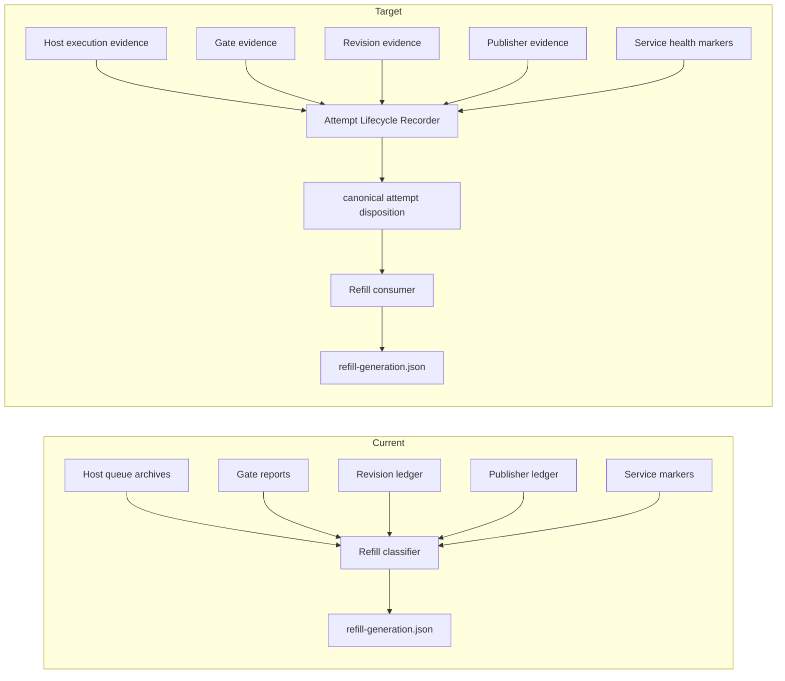

# Canonical Refill Attempt Disposition V1

Status: Draft architecture for Issue #98

Scope: This document defines the target lifecycle contract for capacity-one refill attempts.
It does not authorize implementation.

## Inputs Reviewed

- Issue #98, "Architecture review: canonical terminal disposition for refill attempts".
- Issue #50, especially runtime evidence comment `#5108108854` and the circuit-breaker comment that opened #98.
- Issue #89, "Add evidence-preserving supersession for paused unresolved refill generations".
- Issue #82, "Canonicalize dependency-source hashes across Git line endings".
- Issue #95, "Make refill service graceful stop race-free and deterministic".
- `docs/PERSISTENT_WINDOWS_HOST_V1.md`.
- `docs/CANDIDATE_INTEGRATION_GATE_V1.md`.
- `docs/CONTROLLED_DRAFT_PUBLISHER_V1.md`.
- `src/msos_autobuilder/refill_controller.py`.
- `src/msos_autobuilder/candidate_gate.py`.
- `src/msos_autobuilder/revision_loop.py`.
- `src/msos_autobuilder/controlled_publisher.py`.
- `src/msos_autobuilder/service_error_lifecycle.py`.
- Managed MSOS source copy of `docs/SOP/CHATGPT_GITHUB_CODEX_CONTROL_PLANE_V1.md`.

Evidence gap: the prompt-named `docs/AUTOBUILDER_REPAIR_ADMISSION_AND_CURRENT_DECISION_V1.md`
was not present in this checkout or the managed MSOS source tree inspected for this review.

## Current Lifecycle And Evidence Owners

Current refill state is generation-scoped and lives under the host root:

| Durable record | Current writer | Current reader | Current meaning |
|---|---|---|---|
| `state/refill-policy.json` | Refill CLI/service | Refill service | Enabled, desired capacity, pause/resume, dispatch limits |
| `state/refill-generation.json` | Refill CLI/service | Refill service | Active generation, current attempt, exclusions, provider retry state |
| `state/refill-generation-history/*.json` | Refill CLI/service | Refill service/operator | Immutable archived generation bytes |
| `state/refill-generation-supersessions/*.json` | Refill CLI/service | Refill service/operator | Exact supersession receipt for acknowledged ambiguous historical generations |
| `queue/pending/<job-id>/job.yaml` | Host feed importer | Host/refill | Imported but not yet running job |
| `queue/running/<job-id>/job.yaml` | Host | Host/refill | Claimed running job |
| `queue/completed/<job-id>/report.json` | Host | Relay/refill | Worker completed with patches/report |
| `queue/failed/<job-id>/error.json` | Host | Refill/operator | Worker or host failed before a completed result |
| `state/results-relay-seen.json` | Results relay | Relay/operator | Completed host result was relayed to results branch |
| `state/candidate-gate-seen.json` | Candidate gate | Gate/error lifecycle | Gate processed immutable result evidence |
| `state/candidate-gate-results-repo/results/*/<job-id>/gate-report.json` | Candidate gate | Refill/revision/publisher | Candidate validation result |
| `state/revision-loop-seen.json` | Revision loop | Refill/error lifecycle | Failed gate produced a revision job |
| `state/controlled-publisher-seen.json` | Controlled publisher | Refill/error lifecycle | Passed candidate produced verified draft-publication disposition |
| `state/*-error.json` | Gate/revision/publisher | Refill/error lifecycle | Service-local error marker |
| `state/*-service-success.json` | Gate/revision/publisher | Error lifecycle/refill | Later service success that may supersede service-local errors |

Current refill reconstructs terminality by reading host archives, gate reports, revision
ledger entries, publisher ledger entries, service error markers, and feed/queue state.
`_classify_failed_attempt` only recognizes structured provider failures and a small
provider text-token fallback. Ordinary worker failures, including the Issue #50
`.pytest_cache` `PermissionError`, become `category: unknown`, and reconcile converts
that into `BLOCKED` with `reason: ambiguous_attempt`.

Current-versus-target data flow:

## Canonical Target State Machine

Target design introduces one canonical Attempt Lifecycle Recorder. It is the only writer of
attempt and work-item disposition records. Host, gate, revision, publisher, relay, and refill
may attach or expose their own evidence but do not write canonical disposition.

Attempt records are immutable per transition and monotonic per `job_id`. A record may be
updated only by the recorder while holding the lifecycle lock, and only to a later state.

| State | Meaning | Terminal for attempt | Refill action |
|---|---|---:|---|
| `DISPATCH_PREPARED` | Refill selected a work item and prepared immutable dispatch intent | No | Treat capacity as occupied |
| `DISPATCH_SUBMITTED` | Immutable job was committed to the jobs feed | No | Treat capacity as occupied |
| `HOST_AWAITING_IMPORT` | Job is in feed but not yet in host queue | No | Treat capacity as occupied |
| `HOST_PENDING` | Job is in host pending queue | No | Treat capacity as occupied |
| `HOST_RUNNING` | Job is in host running queue | No | Treat capacity as occupied |
| `EXECUTION_FAILED` | Host archived failed execution evidence | Yes | Follow retry policy or mark work item terminal/non-terminal |
| `EXECUTION_COMPLETED` | Host archived completed worker report | No | Await relay and validation |
| `RESULT_RELAYED` | Relay published canonical worker result evidence | No | Await gate |
| `VALIDATION_FAILED` | Gate reached failed candidate disposition | Yes for this attempt | Await revision disposition if revision is eligible, otherwise item-terminal |
| `VALIDATION_PASSED` | Gate reached passed candidate disposition | No | Await publisher/review disposition |
| `REVISION_QUEUED` | Revision loop queued a descendant job | Yes for source attempt | Track descendant as active lineage |
| `REVISION_EXHAUSTED` | Revision loop determined no more revision may be queued | Yes | Item-terminal unless explicit manual review hold exists |
| `REVIEW_AWAITING` | Passed candidate is awaiting controlled publisher or human review | No | Treat capacity according to review backpressure policy |
| `PUBLICATION_DRAFTED` | Controlled publisher verified and opened/verified a draft PR | Yes | Item-terminal success for refill |
| `PUBLICATION_REJECTED` | Publisher refused with canonical non-retryable disposition | Yes | Item-terminal or founder decision, per reason |
| `PROVIDER_BACKPRESSURE` | Provider/systemic outage with optional trustworthy retry time | No if retryable; yes if non-retryable for attempt | Retry same item once only when authorized |
| `EVIDENCE_MISSING` | Required evidence is absent beyond the recovery window | No | Block fail-closed |
| `EVIDENCE_CONFLICT` | Durable evidence is contradictory or mutated | No | Block fail-closed |
| `SUPERSEDED_HISTORICAL` | Historical generation/attempt preserved under migration boundary | Yes for historical generation only | Not eligible for normal refill interpretation |

Allowed high-level transitions:

| From | To | Owner |
|---|---|---|
| none | `DISPATCH_PREPARED` | Attempt Lifecycle Recorder, from refill prepared-dispatch evidence |
| `DISPATCH_PREPARED` | `DISPATCH_SUBMITTED` | Attempt Lifecycle Recorder, from build-next receipt/feed proof |
| `DISPATCH_SUBMITTED` | `HOST_AWAITING_IMPORT`/`HOST_PENDING` | Attempt Lifecycle Recorder, from feed/host queue evidence |
| `HOST_PENDING` | `HOST_RUNNING` | Attempt Lifecycle Recorder, from host queue evidence |
| `HOST_RUNNING` | `EXECUTION_FAILED` | Attempt Lifecycle Recorder, from host failed archive |
| `HOST_RUNNING` | `EXECUTION_COMPLETED` | Attempt Lifecycle Recorder, from host completed archive |
| `EXECUTION_COMPLETED` | `RESULT_RELAYED` | Attempt Lifecycle Recorder, from relay commit/integrity evidence |
| `RESULT_RELAYED` | `VALIDATION_FAILED`/`VALIDATION_PASSED` | Attempt Lifecycle Recorder, from gate report and gate ledger |
| `VALIDATION_FAILED` | `REVISION_QUEUED`/`REVISION_EXHAUSTED` | Attempt Lifecycle Recorder, from revision ledger or explicit no-revision reason |
| `REVISION_QUEUED` | descendant attempt lifecycle | Attempt Lifecycle Recorder, linked by source and revision job IDs |
| `VALIDATION_PASSED` | `REVIEW_AWAITING` | Attempt Lifecycle Recorder, from gate passed evidence |
| `REVIEW_AWAITING` | `PUBLICATION_DRAFTED`/`PUBLICATION_REJECTED` | Attempt Lifecycle Recorder, from publisher ledger/report |
| any non-terminal | `PROVIDER_BACKPRESSURE` | Attempt Lifecycle Recorder, from structured provider evidence |
| any non-terminal | `EVIDENCE_MISSING`/`EVIDENCE_CONFLICT` | Attempt Lifecycle Recorder, after bounded recovery rules |

## Durable Record Ownership

Canonical target records:

| Record | Sole writer | Permitted evidence attachers/readers |
|---|---|---|
| `state/attempt-lifecycle/attempts/<job-id>.json` | Attempt Lifecycle Recorder | Refill, host, relay, gate, revision, publisher read only |
| `state/attempt-lifecycle/work-items/<work-item-id>.json` | Attempt Lifecycle Recorder | Refill reads item-terminal and retry eligibility |
| `state/attempt-lifecycle/lineages/<root-job-id>.json` | Attempt Lifecycle Recorder | Refill/revision/publisher read lineage |
| `state/attempt-lifecycle/recovery-ledger.json` | Attempt Lifecycle Recorder | Operator/refill read recovery status |
| `state/attempt-lifecycle.lock` | Attempt Lifecycle Recorder | No other writer |
| Existing host/gate/revision/publisher ledgers | Existing service owners | Attempt Lifecycle Recorder reads as source evidence |
| `state/refill-generation.json` | Refill service | Attempt Lifecycle Recorder does not mutate refill generation |

This deliberately separates evidence ownership from lifecycle-disposition ownership. The
host remains the only writer of host queue archives. The gate remains the only writer of
gate reports. The revision loop remains the only writer of revision queue ledger entries.
The controlled publisher remains the only writer of publisher publication ledger entries.
Only the Attempt Lifecycle Recorder converts those artifacts into canonical refill-facing
attempt and work-item disposition.

Disagreement surfaced: this adds a new explicit lifecycle owner. The smaller alternative is
to keep the reducer inside refill, but that preserves the architectural smell named by #98:
refill would remain the final interpreter of service-specific evidence.

## Retry And Terminal Semantics

Execution outcome, candidate validation, revision, publication, retry eligibility, and
refill item terminality are distinct fields in the canonical record:

| Field | Values | Writer |
|---|---|---|
| `execution.outcome` | `completed`, `failed`, `interrupted`, `missing`, `conflict` | Attempt Lifecycle Recorder from host evidence |
| `validation.outcome` | `not_started`, `passed`, `failed`, `unvalidated`, `conflict` | Attempt Lifecycle Recorder from gate evidence |
| `revision.disposition` | `not_required`, `queued`, `exhausted`, `blocked`, `missing`, `conflict` | Attempt Lifecycle Recorder from revision evidence |
| `publication.disposition` | `not_required`, `awaiting_review`, `drafted`, `rejected`, `missing`, `conflict` | Attempt Lifecycle Recorder from publisher evidence |
| `retry.eligibility` | `none`, `same_item_once_after`, `same_item_denied`, `operator_required` | Attempt Lifecycle Recorder |
| `attempt_terminal` | `true`, `false` | Attempt Lifecycle Recorder |
| `item_terminal` | `true`, `false` | Attempt Lifecycle Recorder |
| `refill_action` | `occupy_capacity`, `retry_same_item`, `exclude_item_and_select_next`, `block_fail_closed` | Attempt Lifecycle Recorder |

Semantics:

1. `attempt_terminal=true` means the specific job attempt has stopped changing and should
   not be rerun by accident.
2. `item_terminal=true` means refill may exclude the work item and select the next eligible item.
3. `attempt_terminal=true` does not imply `item_terminal=true`. Failed execution, failed
   gate, and publisher rejection can still require retry, revision, founder review, or a
   fail-closed block.
4. Ordinary host execution failures, including filesystem `PermissionError`, are deterministic:
   `execution.outcome=failed`, `attempt_terminal=true`, `retry.eligibility=operator_required`
   unless a configured structured rule marks the class as safe for an automatic same-item retry.
   Refill must block with canonical evidence, not with a text-token classifier.
5. Provider/systemic failures use structured provider evidence only. Text-token fallback in
   refill is a migration-only compatibility behavior and should be deleted after migration.
6. Automatic retry is same-item only, bounded, explicitly counted, and never item-terminal.
7. Failed validation is not item-terminal until revision disposition is canonical:
   `queued`, `exhausted`, `blocked`, `missing`, or `conflict`.
8. Passed validation is not item-terminal until publisher/review disposition is canonical.
9. `EVIDENCE_MISSING` and `EVIDENCE_CONFLICT` are not retry signals. They block fail-closed.

## Crash, Restart, And Delayed Evidence

The lifecycle recorder must be idempotent and restart-safe:

1. It reads current durable evidence and writes through `state/attempt-lifecycle.lock`.
2. It writes records atomically with previous-state hash, input evidence hashes, and a monotonic
   transition sequence.
3. A crash before the canonical write is retried by rereading source evidence.
4. A crash after the canonical write is detected by the matching previous-state hash and is not
   duplicated.
5. Delayed evidence may advance a non-terminal state only when all prior evidence hashes still
   match. For example, a gate report appearing after `EXECUTION_COMPLETED` advances to
   `VALIDATION_FAILED` or `VALIDATION_PASSED`.
6. Delayed evidence may supersede `EVIDENCE_MISSING` only if the missing state was recorded as
   provisional and within the configured recovery window. `EVIDENCE_CONFLICT` is never
   automatically superseded.
7. Service restarts do not clear canonical lifecycle records. They may only add new source
   evidence that the recorder consumes.
8. Refill restart consumes the latest canonical work-item record. It must not reclassify host,
   gate, revision, or publisher evidence independently.

## Historical Migration Boundary

Migration is one explicit boundary, not a growing list of incident branches:

1. Existing generations and historical job evidence remain immutable.
2. A migration command scans known active and archived refill generations and creates
   `SUPERSEDED_HISTORICAL` canonical records for attempts that predate the lifecycle recorder.
3. The migration record includes generation ID, generation SHA-256, job ID, work item ID,
   prior refill classification, source evidence paths, and an explicit `migration_reason`.
4. The preserved Issue #89 generation and the current Issue #50 A generation are migrated as
   historical unresolved attempts, not item-terminal exclusions.
5. Historical records do not authorize automatic B dispatch by themselves.
6. New attempts created after the lifecycle-recorder release must have canonical lifecycle records
   from dispatch onward. Absence is `EVIDENCE_MISSING`, not compatibility fallback.
7. Migration is closed after the first accepted managed release and installed proof that a fresh
   A attempt is lifecycle-recorded from dispatch through terminal or blocked disposition.

## Duplicate Interpretation And Deletion Plan

After migration and a successful fresh lifecycle witness, delete or demote these duplicate
interpretation paths:

| Current path | Target action |
|---|---|
| `refill_controller._classify_attempt` reading host/gate/revision/publisher evidence | Replace with canonical attempt/work-item disposition read |
| `refill_controller._classify_failed_attempt` text-token provider fallback | Delete after historical migration |
| Refill direct reads of `candidate-gate-results-repo` for terminality | Delete; lifecycle recorder owns interpretation |
| Refill direct reads of `revision-loop-seen.json` for terminality | Delete; lifecycle recorder owns interpretation |
| Refill direct reads of `controlled-publisher-seen.json` for terminality | Keep only for review backpressure until replaced by work-item disposition |
| Refill `revision_disposition_missing` and `revision_descendant_disposition_missing` categories | Replace with canonical `revision.disposition=missing` |
| Refill `ambiguous_attempt` caused by ordinary failed host archive | Replace with canonical `block_fail_closed` and execution failure detail |
| Incident-specific supersession as normal lifecycle tool | Retain only as historical migration/operator escape hatch |
| Service error marker evaluation used by refill as terminal proof | Lifecycle recorder may consume it; refill should not |

No source evidence is deleted. Only duplicate interpretation code paths are removed after
the canonical writer has proven coverage.

## Prior-Incident Regression Fixture Map

| Incident fixture | Source issue/evidence | Expected canonical result |
|---|---|---|
| Provider retry/backpressure | Existing structured provider failure tests and refill provider retry behavior | `PROVIDER_BACKPRESSURE`, same-item retry only after trustworthy retry time and only once |
| Failed candidate gate requiring revision | Issue #82 first A dependency-hash gate failure | `VALIDATION_FAILED`, then `REVISION_QUEUED` or `REVISION_EXHAUSTED`; not item-terminal until revision disposition exists |
| Missing publisher/revision disposition | Issue #89 preserved generation | `SUPERSEDED_HISTORICAL` during migration; fresh equivalent becomes `EVIDENCE_MISSING` and blocks |
| Interrupted generation recovery | Existing prepared dispatch/recovery and Issue #95 restart-stop boundary | Restart replays canonical transition or blocks on conflict without duplicate dispatch |
| Ordinary host execution failure | Issue #50 comment `#5108108854`, `.pytest_cache` `PermissionError` | `EXECUTION_FAILED`, `attempt_terminal=true`, `retry.eligibility=operator_required`, `item_terminal=false`, refill blocks on canonical disposition |
| Successful A terminality followed by automatic B | Issue #50 acceptance goal | A reaches `item_terminal=true` through `PUBLICATION_DRAFTED`, `PUBLICATION_REJECTED` with item-terminal reason, or configured no-publication terminal review disposition; refill excludes A and dispatches B once |
| Feed checkout cache corruption | Issue #50 comment `#5107850091` and recovery update | Not an attempt disposition until a job is submitted; remains runtime health/recovery fixture |
| Graceful stop during lifecycle reconciliation | Issue #95 | Stop request does not lose lifecycle writes; no new reconcile starts after accepted stop |

## Smallest Bounded Implementation Sequence

1. Add the canonical schema, path constants, and read-only validators for attempt, lineage,
   and work-item disposition records. No refill behavior change yet.
2. Add the Attempt Lifecycle Recorder with one lock, atomic writes, and read-only source
   evidence adapters for host, relay, gate, revision, publisher, service error markers, and
   refill prepared/dispatch receipts.
3. Add migration command/tests that create `SUPERSEDED_HISTORICAL` records for the known
   preserved Issue #89 generation and current Issue #50 A generation without editing either.
4. Wire refill to prefer canonical work-item disposition for current attempts while retaining
   old interpretation only behind the migration boundary for pre-recorder attempts.
5. Add focused fixtures from the map above, including the exact `.pytest_cache` `PermissionError`
   archive shape.
6. Remove refill direct interpretation for post-recorder attempts.
7. Open a managed release request, review, merge, install through the external supervisor, and
   verify the recorder and all existing six services are healthy.
8. Run a fresh Issue #50 A attempt and prove canonical disposition is written before refill
   decides whether to block, retry, exclude, or dispatch B.
9. After the fresh witness is accepted, delete migration-only classifier branches and text-token
   fallback in a separate cleanup PR.

## Criteria For Resuming Issue #50

Issue #50 may resume only when all of the following are true:

1. This architecture, or an explicit accepted replacement, is reviewed in GitHub.
2. The bounded implementation issues derived from this design are opened and accepted.
3. A draft implementation PR proves the canonical lifecycle writer, migration boundary,
   and refill consumer behavior with focused tests.
4. Linux and Windows CI pass.
5. A managed exact release containing the canonical lifecycle implementation is published and
   installed through the external supervisor.
6. Runtime evidence shows active release and all managed service witnesses match that exact
   release.
7. The preserved Issue #89 generation and current Issue #50 A evidence remain byte-preserved.
8. The current Issue #50 A `PermissionError` is represented by canonical lifecycle migration
   evidence, not by a manual retry, exclusion, or new refill classifier.
9. Refill remains capacity one. No B or C has been manually submitted.
10. The next A attempt is fresh post-recorder evidence, and refill consumes the canonical
    disposition before advancing to automatic B.

## Coordination Status

Agreement: partial
Compared: Issue #98; Issue #50 comment `#5108108854`; Issue #89; Issue #82; Issue #95;
current refill, host, gate, revision, publisher, and service-error lifecycle code; active
control-plane SOP.
Disagreement: Issue #98 intentionally left the canonical disposition owner unresolved. This
draft recommends a new Attempt Lifecycle Recorder as the sole writer. A refill-local reducer
would be smaller initially but conflicts with the goal that refill stop interpreting service
artifacts.
Evidence gap: missing prompt-named repair-admission doc; no accepted schema yet; no lifecycle
recorder implementation; no migration evidence; no fresh post-recorder A to B witness.
Ownership overlap: current refill overlaps host, gate, revision, publisher, and service-error
evidence interpretation. Target design makes those services evidence owners and the lifecycle
recorder the only disposition writer.
Risk if unresolved: every new worker, gate, revision, or publisher outcome can require another
refill-specific classifier, marker, supersession, or compatibility branch.
Recommended default: accept or revise this single-writer lifecycle boundary before any Issue #50
runtime repair, retry, exclusion, B/C submission, or `.pytest_cache` workaround.
Founder decision required: no
